# 使用Teleport构建云上堡垒机
---
## 前言
---
为了实现云上主机的登录安全，用户会选择部署堡垒机系统，集中管理用户账户，主机安全登录，登录和操作日志审计等。
在堡垒机领域，国内外有多种商业和开源的方案，并可选择基于 Cloud SaaS 和 On-premise 两种部署方式，例如 [CyberArk](https://www.cyberark.com/products/privileged-access-manager/)，[JumpServer](https://www.jumpserver.org/index.html) 等。
 <!-- - [CyberArk](https://www.cyberark.com/products/privileged-access-manager/)： 国外成熟商业产品，提供完整的PAM（Previledged Access Management）方案，支持SaaS和On-premise部署
 - [JumpServer](https://www.jumpserver.org/index.html)： 国内FIT2CLOUD旗下的知名堡垒机产品，提供开源版和商业版，开源版已可实现堡垒机所需的完整功能
 - 等等 -->

目前堡垒机主要工作方式是作为一个代理，实现用户登录，和 SSH/RDP 跳转，在被管理的终端实例上，仍然使用用户名密码，或者 SSH Key 的方式进行登录。

在本文中，将介绍被广泛使用的一款堡垒机产品 [Teleport](https://goteleport.com/)，提供开源版本和企业版，基于自动下发证书的方式，实现用户和被管终端之间连接的认证和登录，不需要借助 SSH 用户密码或 SSH Key。

<font color=red>注意： 国内也有一款名为 [TELEPORT](https://tp4a.com/) 的开源堡垒机产品，请注意区分</font>

下面章节将简要介绍 Teleport 功能和组件，以及如何在 AWS 上，利用多项云原生服务，快速部署一套高可用，生产就绪的 Teleport 堡垒机环境，以及如何利用堡垒机进行 EC2 和 RDS 的远程连接。关于如何使用 Teleport 连接 EKS，请参照 [AWS Blog: Authenticating to EKS Using GitHub Credentials with Teleport](https://aws.amazon.com/blogs/opensource/authenticating-eks-github-credentials-teleport/).

## 1. Teleport 介绍
---
### 1.1 Teleport 主要功能和优势
---
Teleport 是一个身份管理、多协议的访问代理，兼容 SSH、HTTPS、Kubernetes API、MySQL 和 PostgreSQL 协议，支持对内网的 Linux 计算实例、Kubernetes 集群、Web 应用程序、PostgreSQL 和 MySQL 数据库的安全访问，可以方便在 Linux 守护进程或Kubernetes pod 中部署。

Teleport 对用户端使用的工具透明，在完成认证后，用户可以继续使用原有的 SSH，Kubectl，psql，mysql等其他远程连接工具，接入到被管理的资源中。

主要功能和优势：
 1. 使用自动下发证书的方式实现与目标资源之间的安全认证和通信，不需要在目标操作系统上管理密码和 SSH Key
 2. 除了支持 SSH 外，还支持 Kubernetes， MySQL，PostgreSQL 和 HTTP 的安全远程代理访问，用户可选择使用 Web 或 CLI 进行连接
 3. 用户可以继续使用原有的 CLI/GUI 工具进行远程安全连接，例如 OpenSSH, kubectl，mysql client, MySQL workbench等，为用户提供一致的运维体验
 4. 功能完善，原生支持 MFA 认证，用户会话审计日志和屏幕录制
 5. 云原生集成，用户会话审计日志可发送到 DynamoDB，会话屏幕录制文件可存放到 S3
 6. 企业版还支持企业SSO统一认证，和权限申请和审批工作流等

### 1.2 工作方式
---

Teleport 主要包含三个组件：
 - ```Teleport Proxy Service:``` 允许从外部访问集群资源，只有 Proxy 服务才需要对公网开放。
 - ```Teleport Auth Service:``` 集群的证书颁发机构，它向客户端颁发证书并维护审计日志。
 - ```Teleport Node:``` 一个 Node 就是一个需要被远程访问的目标资源， Node 服务在目标资源上或者附近运行，并使用其原生协议，例如 SSH、Kubernetes API、HTTPS、PostgreSQL 或 MySQL 协议，它将用户请求从 Proxy 路由到其目标资源。

 另外Teleport 提供两个 CLI 工具：
  - tctl (Teleport Control): 管理员用来管理 Teleport 集群的命令行工具
  - tsh: 终端用户命令行工具，运行在用户的个人电脑中，用来发起到堡垒机的认证和连接，支持Linux，MacOS，Windows

**Teleport 各组件需要开放的端口：**
| Service | Port | Description                          |
| -----   | ---- | ------------------------------------ |
| Proxy   | 3023 | For clients SSH connect              |
| Proxy   | 3024 | Used to create "reverse SSH tunnels" |
| Proxy   | 3026 | For clients database connect         |
| Proxy   | 3080 | HTTPS connection to authenticate tsh users and web users   |
| Auth    | 3025 | Serve its API to other nodes in a cluster. |
| Node    | 3022 | Teleport's equivalent of port #22 for SSH. |

Teleport 配置文件和数据目录：
 - ```/etc/teleport.yaml```: Teleport 配置文件 （Proxy 和 Auth 服务）
 - ```/var/lib/teleport	```: 数据目录
    -  对于 Teleport Auth： 该目录存放 cluster keys 和 audit log
    -  对于 Teleport Node： 该目录存放节点的 Keys 和 certificates
 - ```/usr/local/bin/```: Teleport 命令行工具目录，包括 teleport, tctl, tsh

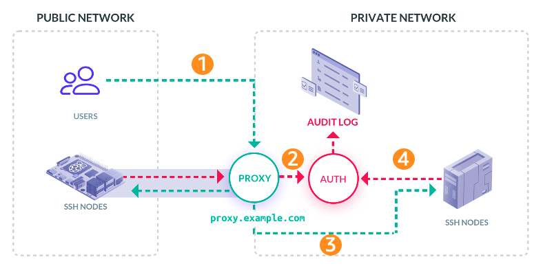

1. 用户登录到 Teleport Proxy，并进行认证，可通过 Proxy 提供的 Web Console，或者 tsh 命令行工具
```
# First, 'tsh' commands authenticates users and configures other
# CLI tools with a client's certificate:

$ tsh login --proxy=proxy.example.com
```
2. Proxy 服务将用户连接请求转发到 Auth 服务进行认证， 通过认证后 Auth 服务将为用户颁发的证书，证书将被 Proxy 服务转发回用户，保存在用户电脑中的 ~/.tsh 目录下

3. 用户通过认证后，利用原有CLI或GUI工具，例如 SSH，Kubectl，mysql等，进行远程连接，连接将被 Proxy 代理到后端的目标资源
```
# SSH access as usual:
$ ssh user@host

# Kubernetes access as usual:
$ kubectl get pods

# Databse access as usual:
$ psql
```
4. 被连接的目标资源通过 Auth 验证用户的证书，验证通过后建立与 Proxy 的连接

## 2. 在 AWS 上部署高可用的 Teleport 堡垒机环境
---

Teleport 支持以 Linux 操作系统进程和容器两种方式部署，且Teleport Proxy 服务和 Auth 服务可进行单机或分布式部署。

如果需要快速体验 Teleport 的基本功能，可以采用以下方式快速部署一个单机环境，所有组件部署在一台 EC2 实例上。
```
## 需准备一个公网可解析的域名， Teleport 会帮用户自动从Let's Encrypt申请一个对应的 TLS 证书
sudo yum-config-manager --add-repo https://rpm.releases.teleport.dev/teleport.repo
sudo yum install teleport

sudo teleport configure --acme --acme-email=your-email@example.com --cluster-name=tele.example.com -o file
Wrote config to file "/etc/teleport.yaml". Now you can start the server. Happy Teleporting!

sudo teleport start
```

如果在生产环境中使用堡垒机，则要考虑高可用部署，负载均衡，故障恢复等，需要详细的规划设计。

**下面将介绍如何部署一套生产环境的 Teleport 堡垒机环境，以及详细步骤。**

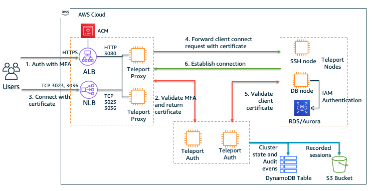

部署架构：
 - Teleport Proxy  和 Teleport Auth 采用分布式独立部署
 - 两台 Teleport Proxy 高可用部署，无状态
 - 两台 Teleport Auth 高可用部署，集群状态使用 DynamoDB 作为共享存储
 - 一台 Teleport SSH Node 用来验证 SSH 连接
 - 一台 Teleport DB Node 用来实现 RDS 数据库连接
 - 使用 ALB 为 Telport Proxy Web 连接提供负载均衡
 - 使用 NLB 为 Teleport Proxy SSH 和 MySQL 连接提供负载均衡
 - 使用 ACM 为 ALB 颁发 HTTPS 证书
 - 将 Teleport 连接的会话日志存放到 DynamoDB
 - 将 Teleport 连接的会话屏幕录制存放到 S3

### 2.1 安装部署
---
Teleport 可通过 Yum 或二进制包的方式安装，同一个安装包，根据定义不同的配置文件，用来部署各个组件。

在所有实例上（共6台 EC2 实例，2* Proxy，2* Auth，2* Node）运行以下命令安装 Teleport 软件包。
```
sudo yum-config-manager --add-repo https://rpm.releases.teleport.dev/teleport.repo
sudo yum install teleport -y
```
#### 2.1.1 安装部署 Teleport Auth
---
首先配置 Teleport Auth 服务，在两台 Teleport Auth 实例上，创建并修改 Auth 配置文件，```sudo vi /etc/teleport.yaml```.
```
# === Teleport Auth Configuration ===
teleport:
  nodename: Auth-1                    ## 指定两台 Auth 节点名称
  data_dir: /var/lib/teleport
  log:
    output: stderr
    severity: INFO
  ca_pin: ""
  auth_servers:
      - 127.0.0.1:3025                ## 指定两台 Auth 节点的IP地址
      - 172.31.37.144:3025            ## 指定两台 Auth 节点的IP地址
  storage:                            
    type: dynamodb                    ## 使用DynanoDB存放集群状态和审计日志
    region: ap-northeast-1

    # DynamoDB table name for cluster state, teleport will create the table
    table_name: TestCluster-TeleportClusterState

    # DynamoDB table name for audit sessions, teleport will create the table
    audit_events_uri:  ['dynamodb://TestCluster-TeleportAuditEvents', 'file:///var/lib/teleport/audit/events', 'stdout://']

    # This setting configures Teleport to save the recorded sessions in an S3 bucket:
    audit_sessions_uri: s3://hxh-tokyo/TeleportRecordedSession/records
auth_service:
  enabled: "yes"
  listen_addr: 0.0.0.0:3025
  cluster_name: "teleport.awsguru.top"    ## 指定Teleport cluster name
  authentication:
    # Default authentication type. possible values are 'local' and 'github' for OSS
    #  and 'oidc', 'saml' and 'false' for Enterprise.
    type: local
    # second_factor can be off, on, optional, otp, or u2f
    second_factor: otp
ssh_service:
  enabled: "no"
proxy_service:
  enabled: "no"
```
**注意，Auth Server 使用 DynamoDB 作为 Cluster State 和 Audit Event 存储，以及使用 S3 作为 Recorded Session 存储，需要为 Auth EC2 关联 IAM Role，授予相应 DynamoDB 和 S3 的访问权限**
```
### IAM Permission for putting cluster state and audit events in DynamoDB
{
    "Version": "2012-10-17",
    "Statement": [
        {
            "Sid": "ClusterStateStorage",
            "Effect": "Allow",
            "Action": [
                "dynamodb:BatchWriteItem",
                "dynamodb:UpdateTimeToLive",
                "dynamodb:PutItem",
                "dynamodb:DeleteItem",
                "dynamodb:Scan",
                "dynamodb:Query",
                "dynamodb:DescribeStream",
                "dynamodb:UpdateItem",
                "dynamodb:DescribeTimeToLive",
                "dynamodb:CreateTable",
                "dynamodb:DescribeTable",
                "dynamodb:GetShardIterator",
                "dynamodb:GetItem",
                "dynamodb:UpdateTable",
                "dynamodb:GetRecords"
            ],
            "Resource": [
                "arn:aws:dynamodb:<region>:<account_id>:table/<cluster_state_table_name>",
                "arn:aws:dynamodb:<region>:<account_id>:table/<cluster_state_table_name>/stream/*"
            ]
        },
        {
            "Sid": "ClusterEventsStorage",
            "Effect": "Allow",
            "Action": [
                "dynamodb:CreateTable",
                "dynamodb:BatchWriteItem",
                "dynamodb:UpdateTimeToLive",
                "dynamodb:PutItem",
                "dynamodb:DescribeTable",
                "dynamodb:DeleteItem",
                "dynamodb:GetItem",
                "dynamodb:Scan",
                "dynamodb:Query",
                "dynamodb:UpdateItem",
                "dynamodb:DescribeTimeToLive",
                "dynamodb:UpdateTable"
            ],
            "Resource": [
                "arn:aws:dynamodb:<region>:<account_id>:table/<events_table_name>",
                "arn:aws:dynamodb:<region>:<account_id>:table/<events_table_name>/index/*"
            ]
        }
    ]
}


### IAM Permission for putting recorded session in S3
{
    "Version": "2012-10-17",
    "Statement": [
        {
            "Sid": "ClusterSessionsStorage",
            "Effect": "Allow",
            "Action": [
                "s3:PutEncryptionConfiguration",
                "s3:PutObject",
                "s3:GetObject",
                "s3:GetEncryptionConfiguration",
                "s3:GetObjectRetention",
                "s3:ListBucketVersions",
                "s3:CreateBucket",
                "s3:ListBucket",
                "s3:GetBucketVersioning",
                "s3:PutBucketVersioning",
                "s3:GetObjectVersion"
            ],
            "Resource": [
                "arn:aws:s3:::<bucket_name>/*",
                "arn:aws:s3:::<bucket_name>"
            ]
        }
    ]
}

```

配置文件创建完成后，将 Teleport 服务设置为开机自启动，并启动服务，查看服务状态和集群的 CA Pin（将在会 Proxy 和 Node 的配置文件中使用，作为加入集群的验证）
```
sudo systemctl enable teleport
sudo service teleport start
sudo service teleport status -l
```
通过 tctl 命令行工具查看集群状态
```
sudo /usr/local/bin/tctl status

=====Output=====
Cluster  teleport.awsguru.top
Version  6.2.8
Host CA  never updated
User CA  never updated
Jwt CA   never updated
CA pin   sha256:87aec19f7dbe6b90709872e1adb4d9aa7d8fd45a242749b4aecebf4de935f93e
```
生成并记录 Proxy, SSH node 和 DB node 加入集群时所需的 Token，在后续步骤 Proxy，SSH node 和 DB node 的配置文件中将使用该 Token，默认1小时有效。
```
sudo /usr/local/bin/tctl tokens add --type=proxy

=== Sample Output ===
The invite token: 0df348f2db7280745b4d4d66d227b95d
This token will expire in 60 minutes

sudo /usr/local/bin/tctl tokens add --type=node
sudo /usr/local/bin/tctl tokens add --type=db
```

查看当前有效的 Token，类型和有效期。
```
sudo /usr/local/bin/tctl tokens ls
```

#### 2.1.2 安装部署 Teleport Proxy
---
在两台 Proxy 实例上，通过 Yum 安装 Teleport 软件包，然后创建配置文件```sudo vi /etc/teleport.yaml```.
```
# === Teleport Proxy Configuration ===
teleport:
  nodename: Proxy-1                             ## 指定两台 Proxy 节点名称
  data_dir: /var/lib/teleport
  log:
    output: stderr
    severity: INFO
  ca_pin: "sha256:87aec19f7dbe6b90709872e1adb4d9aa7d8fd45a242749b4aecebf4de935f93e"   ## 粘贴集群的ca pin
  auth_token: 0df348f2db7280745b4d4d66d227b95d                    ## 粘贴Auth上生成的 Proxy Token
  auth_servers:
      - 172.31.41.35:3025                        ## 指定两台 Auth 节点的 IP 地址
      - 172.31.37.144:3025                      
proxy_service:
  enabled: "yes"
  listen_addr: 0.0.0.0:3023
  web_listen_addr: 0.0.0.0:3080
  https_keypairs: []
  acme: {}
  public_addr: teleport.awsguru.top:443                   ## 指定Proxy对外的Web域名和端口，将被配置指向ALB
  ssh_public_addr: connect.teleport.awsguru.top:3023      ## 指定Proxy对外的SSH连接域名和端口，将被配置指向NLB
  mysql_listen_addr: "0.0.0.0:3036"
  mysql_public_addr: "connect.teleport.awsguru.top:3306"  ## 指定Proxy对外的MySQL连接域名和端口，将被配置指向NLB
auth_service:
  enabled: "no"
ssh_service:
  enabled: "no"
```

配置文件创建完成后，将 Teleport 服务设置为开机自启动，修改启动脚本并重新加入，然后启动服务

**注意：因为HTTPS证书将被offload到ALB上，Proxy 节点不再验证域名的证书，所以需要修改Systemd中的teleport服务启动脚本，添加--insecure-no-tls参数**
```
sudo systemctl enable teleport

sudo vi /usr/lib/systemd/system/teleport.service
## 启动脚本修改为：
/usr/local/bin/teleport start --pid-file=/run/teleport.pid --insecure-no-tls

sudo systemctl daemon-reload
sudo service teleport start
sudo service teleport status -l
```

创建和配置用于从互联网连接 Proxy 的 ALB 和 NLB，使用 ACM 为 ALB 提供 Proxy 外部域名的 HTTPS 证书 。
| Type  | Listener    | Target        |
| ----- | --------    | ------------  |
| ALB   | HTTPS: 443  | HTTP: 3080    |
| NLB   | TCP: 3023   | TCP: 3023     |
| NLB   | TCP: 3306   | TCP: 3036     |

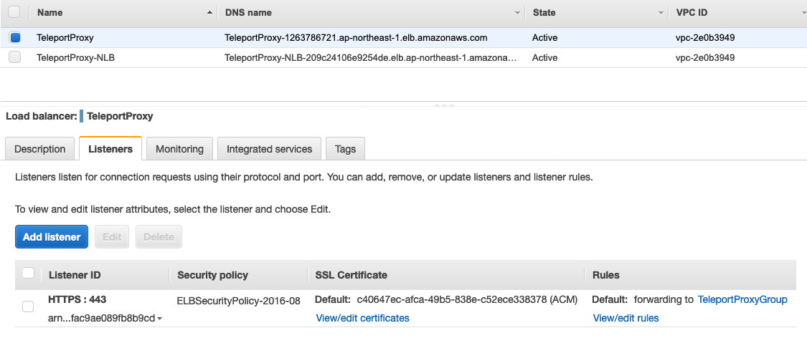
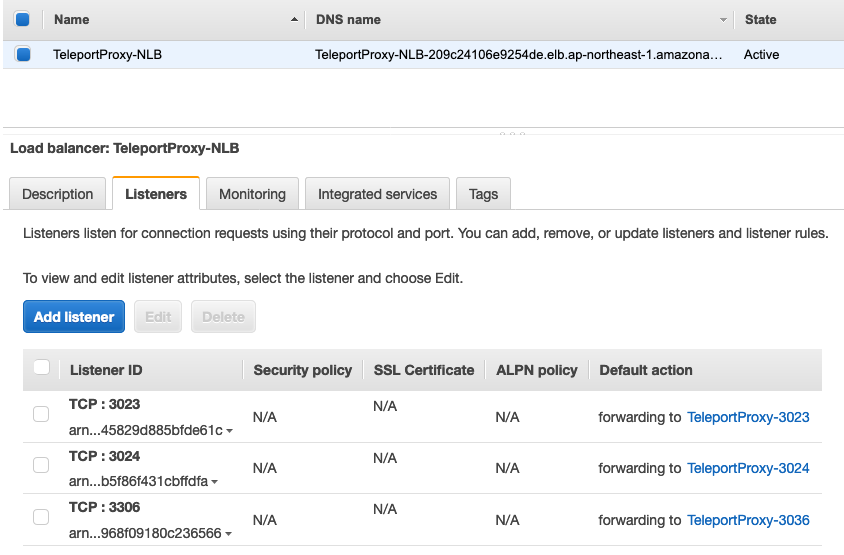

#### 2.1.3 安装部署 Teleport Node for SSH
---
在需要被堡垒机管理的EC2实例上，通过 Yum 安装 Teleport 软件包，然后创建配置文件```sudo vi /etc/teleport.yaml```
```
# === Teleport Node Configuration ===
teleport:
  nodename: TestNode                   ## 指定实例在Teleport中显示的name，后续可用NodeName发起远程连接
  data_dir: /var/lib/teleport
  log:
    output: stderr
    severity: INFO
  ca_pin: "sha256:87aec19f7dbe6b90709872e1adb4d9aa7d8fd45a242749b4aecebf4de935f93e"  
  auth_token: 57558b695154fd982d79879d30be0069         ## 前面步骤中在 Auth 上生成的 SSH node token
  auth_servers:
      - 172.31.41.35:3025                        ## 指定两台 Auth 节点的 IP 地址
      - 172.31.37.144:3025                       
proxy_service:
  enabled: "no"
auth_service:
  enabled: "no"
ssh_service:
  enabled: "yes"
  listen_addr: 0.0.0.0:3022
  labels:                                       ## 可对 Node 添加一个或多个label，label可用于授权
      env: test
```
配置文件创建完成后，将 Teleport 服务设置为开机自启动，并启动服务
```
sudo systemctl enable teleport
sudo service teleport start
sudo service teleport status -l
```
在 Auth 节点上，可通过tctl 命令行工具查看节点状态
```
sudo /usr/local/bin/tctl nodes ls

=== Sample Output ===
Nodename   UUID                                 Address            Labels
---------- ------------------------------------ ------------------ --------
TestNode   8cda5210-1226-4b2e-8d99-c104a3171226 172.31.11.145:3022 env=test

```

#### 2.1.4 安装部署 Teleport Node for Database
---
通过 Teleport 堡垒机连接数据库，是需要在 Teleport Node 上运行 DB Service，为用户提供数据库的远程安全连接，支持 MySQL 和 PostgreSQL，包括 RDS，Aurora，自建数据库，以及 Redshift。可以在某个运行 SSH Service 的 Teleport Node 上启用 DB Service，也可以单独运行一个 Teleport Node 用于数据库接入。

**AWS RDS 和 Aurora 的 Teleport Database Access 必须使用 IAM 身份验证和 SSL 连接，下面将以 Aurora MySQL 举例介绍详细步骤。**

首先配置 Aurora 安全组，允许 Teleport DB node 访问数据库的 3306 端口，并且 Teleport DB node 需要具备使用 IAM Authentication 连接数据库的 IAM 权限
```
{
   "Version": "2012-10-17",
   "Statement": [
      {
         "Effect": "Allow",
         "Action": [
             "rds-db:connect"
         ],
         "Resource": [
             "arn:aws:rds:ap-northeast-1:699962710372:dbuser:cluster-5TGS5J4CJ6VYAAZI6KMVTGWHJM/dbiam"
         ]
      }
   ]
}

```

然后修改 Aurora Cluster，开启 IAM Authentication
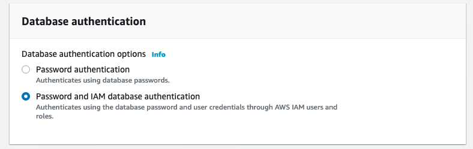

通过 Password 方式连接到数据库，创建将用于 IAM Authentication 的 DB User（dbiam），并授权权限。
```
CREATE USER dbiam IDENTIFIED WITH AWSAuthenticationPlugin AS 'RDS'; 

GRANT ALL ON `%`.* TO 'dbiam'@'%';            
```

创建 Teleoprt Node 配置文件，启用 DB Service，```sudo vi /etc/teleport.yaml```
```
teleport:
  nodename: DB-Test
  data_dir: /var/lib/teleport-db
  # Proxy address to connect to. Note that it has to be the proxy address
  # because database service always connects to the cluster over reverse
  # tunnel.
  auth_token: d441c64236c28986a2838b926fb4c201      ## 前面步骤中在 Auth 上生成的 DB token 
  auth_servers:
  - teleport.awsguru.top:443           ## db service 的 auth server 需要配置为 Proxy 的 public domain
db_service:
  enabled: "yes"
  # one db service could support multiple database definitions
  databases:
    # Name of the database proxy instance used to reference in CLI.
  - name: "Aurora-Test"
    # Free-form description of the database proxy instance.
    description: "AWS Aurora MySQL"
    # Database protocol.
    protocol: "mysql"
    # Database address, an example of AWS Aurora:
    uri: "test1.cluster-cluqkc7jqkna.ap-northeast-1.rds.amazonaws.com:3306"
    # AWS-specific configuration, only required for RDS and Aurora.
    aws:
      # Region the database is deployed in.
      region: ap-northeast-1
    # Labels to assign to the database, used in RBAC.
    static_labels:
      env: test
auth_service:
  enabled: "no"
ssh_service:
  enabled: "no"
proxy_service:
  enabled: "no"

```
RDS IAM Authentication 需要 SSL 连接，如果在配置文件中没有指定 SSL 证书文件路径，Teleport 会自动下载最新的 RDS CA 证书，并存放到/var/lib/teleport-db/目录用于 RDS 数据库连接，目前最新的 RDS 证书为： ```rds-ca-2019-root.pem```

配置文件创建完成后，将 Teleport 服务设置为开机自启动，并启动服务
```
sudo systemctl enable teleport
sudo service teleport start
sudo service teleport status -l
```
在 Auth 节点上，可通过tctl 命令行工具查看节点状态
```
sudo /usr/local/bin/tctl db ls

=== Sample Output ===
Name        Protocol Address                                                          Labels
----------- -------- ---------------------------------------------------------------- --------
aurora-test mysql    test1.cluster-cluqkc7jqkna.ap-northeast-1.rds.amazonaws.com:3306 env=test

```

### 2.2 创建 Role 和 User，用于远程连接
---

Teleport 通过 Role 实现精细化权限控制，系统默认预置了4个 Role，分别为 admin，editor，access，auditor。

我们首先创建一个管理员用户，具备 admin 和 editor 角色，在 Teleport Auth 上执行一下命令，创建用户并分配 Role。
```
sudo /usr/local/bin/tctl users add --roles=admin,editor admin

=== Sample Output ===
User "admin" has been created but requires a password. Share this URL with the user to complete user setup, link is valid for 1h:
https://teleport.awsguru.top:443/web/invite/12b7133370f84db7da902313db61705d
```
执行完成后，会生成一个一次性的临时链接，用户通过该 URL 链接进行密码和 OTP MFA 的设置，完成用户账户创建。

首先设置密码，然后用手机下载 Google Authenticator，并使用 Google Authenticator App 扫描右侧的二维码，生成 MFA Token，在页面上填入 Token。

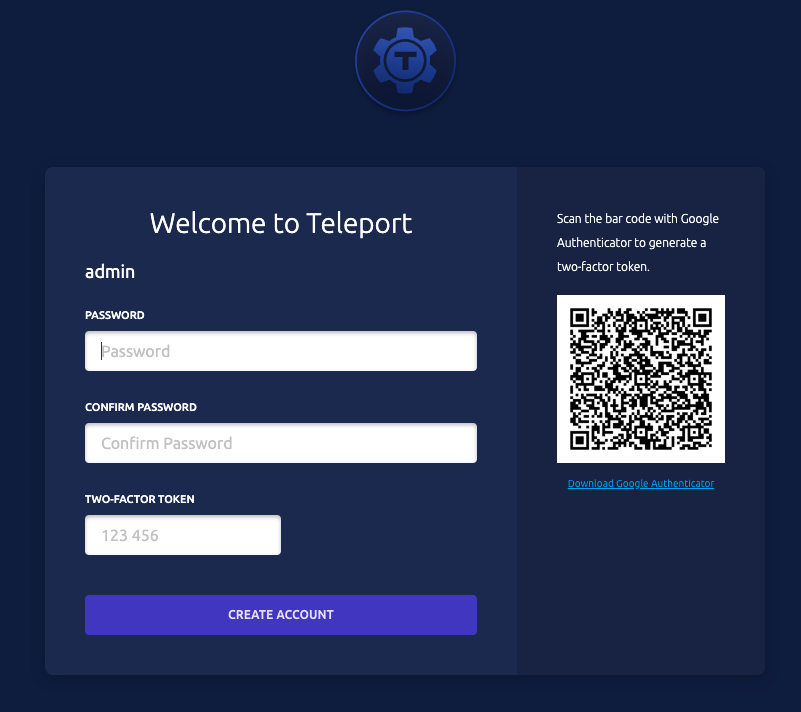

完成用户注册后，自动进入 Teleport Web Console。

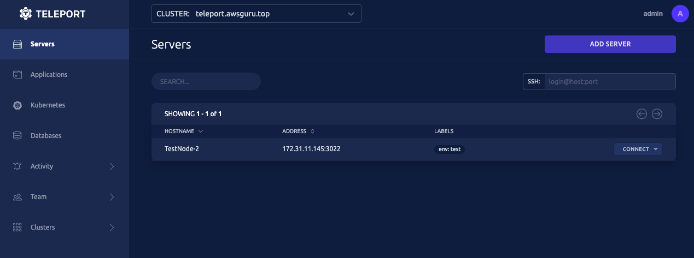

接下来创建一个自定义的 Role，用于远程 SSH 和 数据库连接，可使用 tctl 命令行工具或在 Web Console 上进行 Role 的创建。
 - RoleName: test-role
 - 权限：连接所有 SSH 节点和数据库 （可通过 node label 进行权限过滤）
 - 允许 SSH 使用的用户名：ec2-user 和 test  （用户名需在被登录的操作系统中存在）

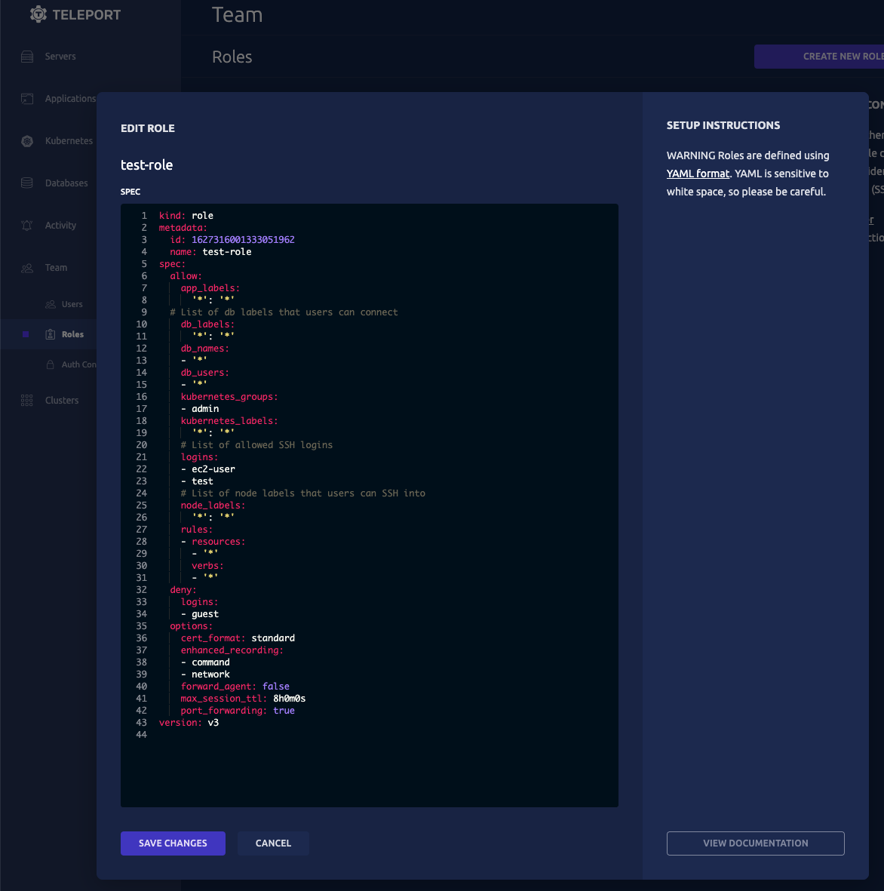

如果使用 tctl 命令行工具创建，则在 Teleport Auth 上执行以下命令：
```
sudo /usr/local/bin/tctl create <<EOF
kind: role
version: v3
metadata:
  name: test-role
spec:
  allow:
    app_labels:
      '*': '*'
    db_labels:
      '*': '*'
    db_names:
    - '*'
    db_users:
    - '*'
    kubernetes_groups:
    - admin
    kubernetes_labels:
      '*': '*'
    logins:
    - ec2-user
    - test
    node_labels:
      '*': '*'
    rules:
    - resources:
      - '*'
      verbs:
      - '*'
  deny:
    logins:
    - guest
  options:
    cert_format: standard
    enhanced_recording:
    - command
    - network
    forward_agent: false
    max_session_ttl: 8h0m0s
    port_forwarding: true
EOF

```

然后创建 User，用户名为 test，并关联到 test-role。

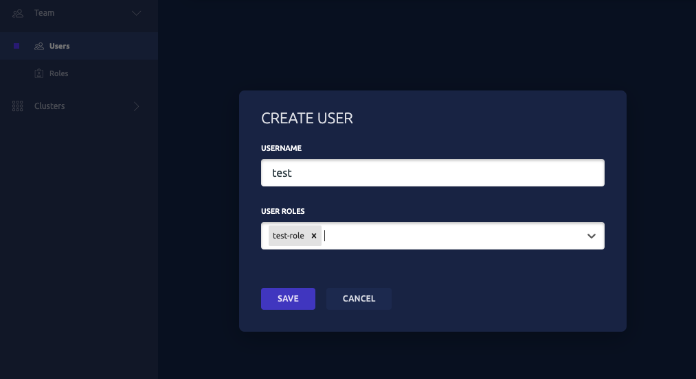

创建完成后，同样会生成一个一次性的临时链接，用户通过该 URL 链接进行密码和 OTP MFA 的设置，完成用户账户创建。

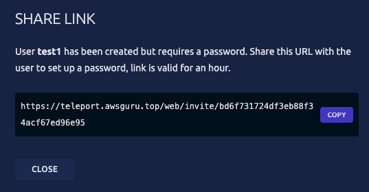

## 3 通过 Teleport 连接 EC2 和 RDS
---
Teleport的一个主要优势，是用户在利用 tsh 客户端工具完成登录认证之后，可以继续使用原有的工具进行远程安全连接，例如 OpenSSH, mysql client, MySQL workbench等，为用户提供一致和熟悉的运维体验。

首先在电脑上[下载安装 tsh 客户端工具](https://goteleport.com/teleport/download/)，支持 Linux，Windows，和 MacOS。

通过 tsh，发起连接和认证，指定 Proxy 的对外域名，端口和连接使用的用户名，输入密码和 MFA OTP Token。认证成功后，可以看到用户对应的 Role，允许使用的 SSH 用户，以及会话有效期（默认8小时，可以在 Role 和 User 中配置会话 TTL）。
```
tsh login --proxy teleport.awsguru.top:443 --user test

HXH:~ hxh$ tsh login --proxy teleport.awsguru.top:443 --user test
Enter password for Teleport user test:
Enter your OTP token:
737538
> Profile URL:        https://teleport.awsguru.top:443
  Logged in as:       test
  Cluster:            teleport.awsguru.top
  Roles:              test-role
  Logins:             ec2-user, test
  Kubernetes:         disabled
  Valid until:        2021-07-27 19:54:23 +0800 CST [valid for 8h0m0s]
  Extensions:         permit-port-forwarding, permit-pty

HXH:~ hxh$
```

### 3.1 通过 Teleport 连接 EC2 实例
---
登录成功后，通过 ```tsh status``` 查看当前会话状态，确认会话是否超时。
```
HXH:~ hxh$ tsh status
> Profile URL:        https://teleport.awsguru.top:443
  Logged in as:       test
  Cluster:            teleport.awsguru.top
  Roles:              test-role
  Logins:             ec2-user, test
  Kubernetes:         disabled
  Valid until:        2021-07-27 19:54:23 +0800 CST [valid for 7h57m0s]
  Extensions:         permit-port-forwarding, permit-pty
```
通过 ```tsh ls``` 查看可以允许 SSH 连接的实例
```
HXH:~ hxh$ tsh ls
Node Name  Address            Labels
---------- ------------------ --------
TestNode-2 172.31.11.145:3022 env=test
```
然后 ```tsh ssh "ssh-user"@"NodeName/IP"``` 发起 SSH 连接
```
HXH:~ hxh$ tsh ssh ec2-user@TestNode-2
[ec2-user@ip-172-31-11-145 ~]$
```
连接到实例后，所有的操作记录都会被录屏。

如果使用 Teleport Web Console，可以直接点击 Connect ，选择连接的用户名，即可在浏览器中打开 SSH 会话，支持同时连接多个会话。

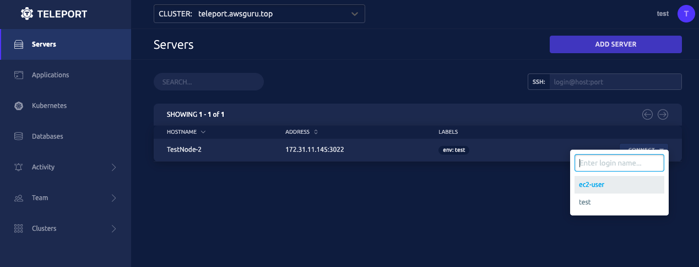
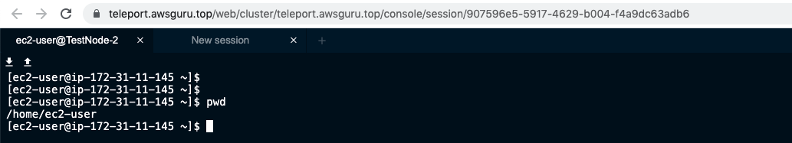

### 3.2 通过 Teleport 连接 RDS 数据库 
---
Teleport 暂不支持在 Web Console 中直接连接数据库，需要使用 tsh 完成会话认证，然后使用 mysql client 或 MySQL workbench 等工具连接数据库。

首先通过 ```tsh status``` 确认会话未过期，然后 ```tsh db ls``` 查看当前可以连接的数据库列表。
```
HXH:~ hxh$ tsh db ls
Name        Description      Labels   Connect
----------- ---------------- -------- -------
aurora-test AWS Aurora MySQL env=test
```

```tsh db login "db-name"``` 登录数据库，会返回可使用 mysql client 连接数据库的字符串。
```
HXH:~ hxh$ tsh db login aurora-test

Connection information for MySQL database "teleport.awsguru.top-aurora-test" has been saved.

You can now connect to the database using the following command:

  $ mysql --defaults-group-suffix=_teleport.awsguru.top-aurora-test

Or configure environment variables and use regular CLI flags:

  $ eval $(tsh db env)
  $ mysql

HXH:~ hxh$
```
然后正常使用 mysql 客户端连接数据库，**注意使用 -u 指定 RDS IAM Authentication 的用户名**。
```
HXH:~ hxh$ mysql --defaults-group-suffix=_teleport.awsguru.top-aurora-test -u dbiam
Welcome to the MySQL monitor.  Commands end with ; or \g.
Your MySQL connection id is 207064
Server version: 8.0.0-Teleport MySQL Community Server (GPL)

Copyright (c) 2000, 2019, Oracle and/or its affiliates. All rights reserved.

Oracle is a registered trademark of Oracle Corporation and/or its
affiliates. Other names may be trademarks of their respective
owners.

Type 'help;' or '\h' for help. Type '\c' to clear the current input statement.

mysql>
```

如果需要使用 MySQL workbench 连接数据库，通过 ```tsh db config``` 获取 MySQL workbench 连接所需的配置信息。
```
HXH:~ hxh$ tsh db config
Name:      aurora-test
Host:      connect.teleport.awsguru.top
Port:      3306
User:
Database:
CA:        /Users/hxh/.tsh/keys/teleport.awsguru.top/certs.pem
Cert:      /Users/hxh/.tsh/keys/teleport.awsguru.top/test-db/teleport.awsguru.top/aurora-test-x509.pem
Key:       /Users/hxh/.tsh/keys/teleport.awsguru.top/test
```

配置MySQL workbench 连接环境：
 - Hostname: connect.teleport.awsguru.top
 - Username: dbiam
 - Use SSL: Require and Verify Identity
 - 指定 SSL Key File, SSL Cert File, SSL CA File
 
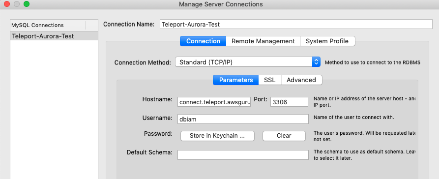
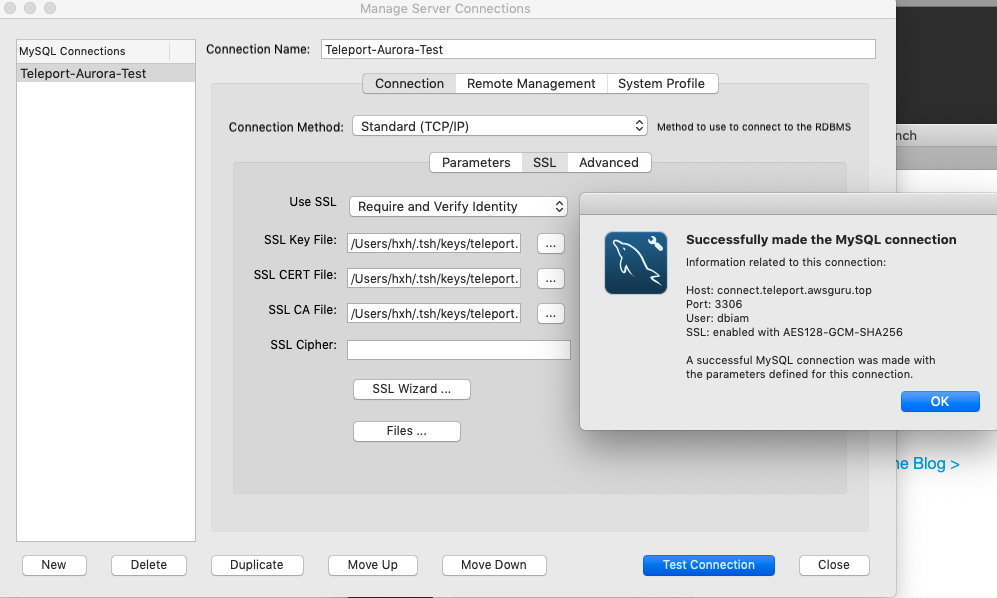

完成 MySQL Workbench 连接配置后，即可正常使用工具进行 database 操作。
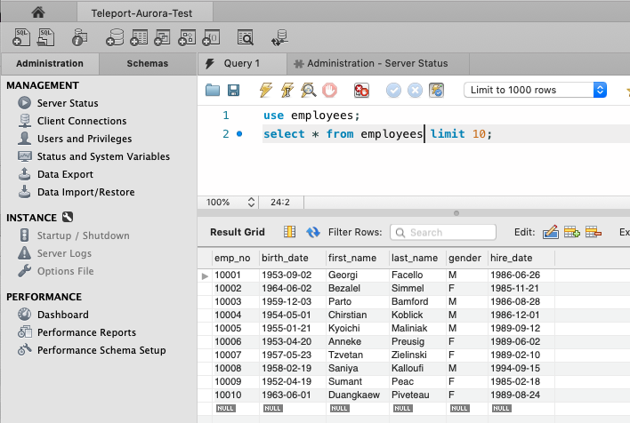

### 3.3 查看审计日志
---
用户在 Teleport 堡垒机中所有的登录，SSH 会话，数据库连接，数据库操作(DDL/DML)等，均会被记录在审计日志中。

根据 Teleport Auth 的配置，审计日志会保存在 Teleport Auth 本地目录和指定的 DynamoDB Table 中，通过 Teleport Web Console 或者在 DynamoDB 中可以查看审计日志。

每条审计日志中会包括：
 - SessionID: 会话的唯一标识符
 - Timestamp: 审计日志时间戳
 - EventType: 审计日志类型，例如 SessionStart, SessionEnd, SessionUpload, DBSessionStart, DBSessionQuery等
 - Fields: 每条日志的详细信息，包括
   - 用户名，SSH 登录名
   - 所连接的Node，database 的 IP / FQDN 等信息
   - SSH 会话录像的存放路径 (session uploaded)
   - 如果事件类型是 DB Query，还将记录执行的 DDL/DML 语句

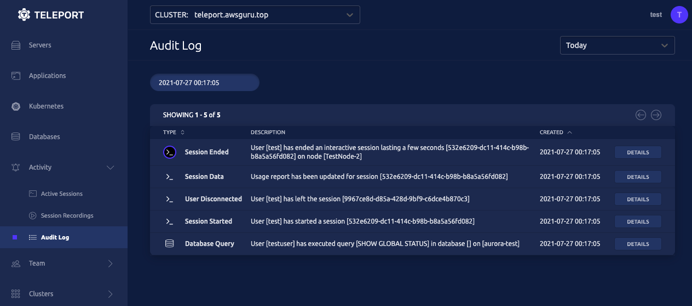

在Web Console 中，只能根据文本匹配搜索，不太方便精确查找日志。在 DynamoDB 中可以根据 Session-ID, 时间范围，事件类型，详细日志信息等查询和过滤审计日志。

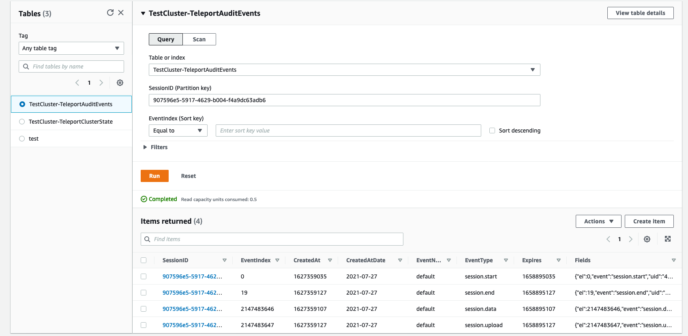

### 3.4 查看会话录屏
---
根据配置，对于所有 SSH 连接，在会话结束后 Teleport Auth 会以 Blob 格式保存会话的屏幕录像，并上传到指定的 S3 路径。数据库连接会话暂不支持录屏。

在 Teleprot Web Console 中，可以根据当前用户 SSH 会话的 SessionID 直接回放录屏内容，其中 SessionID 可从审计日志中获取。

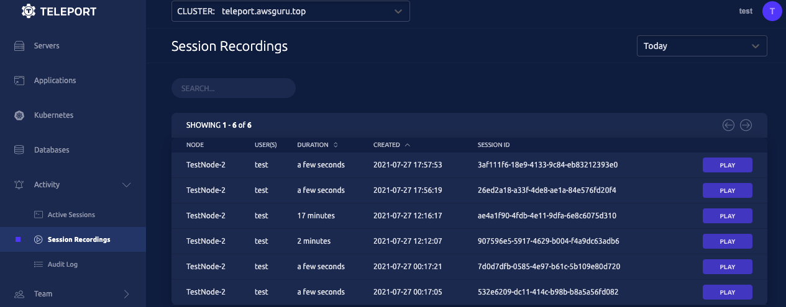

另外也可以使用 tsh 命令行工具，回放当前用户的某个会话录像 ```tsh play "session-id``` 。

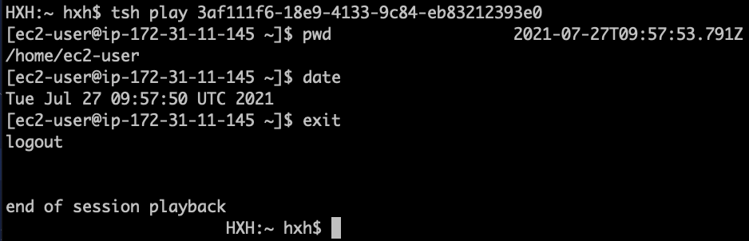

## 总结
---
Teleport 作为一款功能完善，简单易用的堡垒机产品，其开源版本已能满足大多数用户需求，主要优势是可为用户提供一致的运维体验，以及与 AWS 多种服务的原生集成。

用户可参照上述步骤，结合 AWS 云原生服务，包括 ELB，ACM，DynamoDB，S3，快速构建一套生产就绪的堡垒机环境，实现 AWS 云上 EC2，RDS，Redshift，EKS 等资源远程登录的安全控制和审计。

## 本篇作者
---
胡新华

AWS解决方案架构师，负责金融行业基于AWS的云计算架构技术咨询和方案设计。加入AWS之前就职于IBM，在数据中心IT基础架构相关的解决方案设计和交付方面，具有十多年经验。

